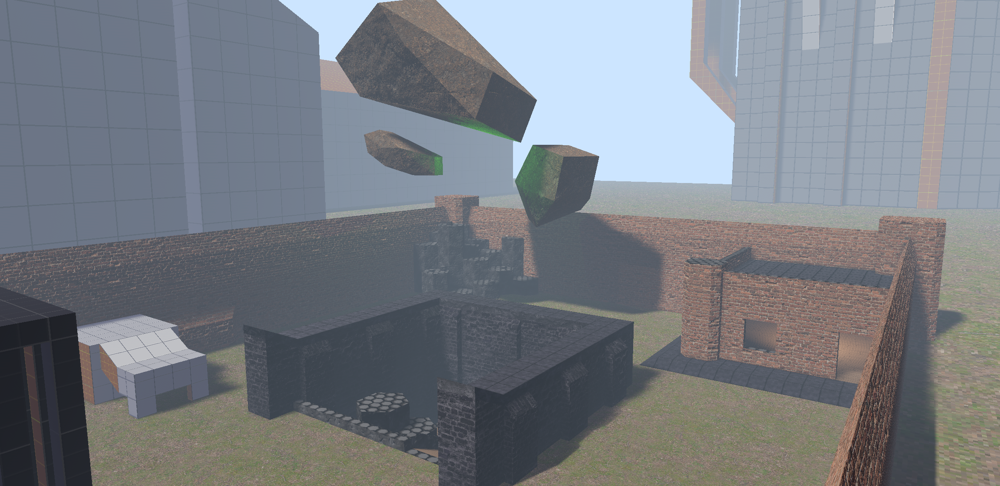

# bevy_trenchbroom

[](https://crates.io/crates/bevy_trenchbroom)
[](https://docs.rs/bevy_trenchbroom)

Streamlined workflow for creating maps with TrenchBroom and ericw-tools (if compiling maps), supporting loading .map and .bsp files, defining a TrenchBroom game configuration and entities definitions with code, and more!


<label>(A testing map i made, loaded with bevy_trenchbroom)</label>

<br>

# How to use
First add the `bevy_trenchbroom` to your project: `cargo add bevy_trenchbroom`.

Then, simply add the `TrenchBroomPlugin` with a supplied `TrenchBroomConfig` to your app like so:

```rust
use bevy::prelude::*;
use bevy_trenchbroom::prelude::*;

fn main() {
    App::new()
        // ...
        // TrenchBroom maps use repeating textures, and currently by default bevy's images don't repeat.
        // Use `repeating_image_sampler` to easily create a sampler for this that is optionally filtered.
        .add_plugins(DefaultPlugins.set(ImagePlugin { default_sampler: repeating_image_sampler(false) }))
        .add_plugins(TrenchBroomPlugin::new(trenchbroom_config()))
        // ...
    ;
}

// Because of how big it tends to get, I recommend putting your `TrenchBroomConfig` in a separate function, most likely in its own module.
fn trenchbroom_config() -> TrenchBroomConfig {
    TrenchBroomConfig::new("example_game") // <- The name of your game
        // Here you can customize the resulting game configuration with a builder-like syntax
        .entity_scale_expression("scale")
        // ...


        // You can define entity definitions here with a rust-like macro-powered domain specific language, these are written to your game's FGD file, and used for spawning entities

        // It's standard practice to make the first defined entity your `worldspawn`
        .entity_definitions(entity_definitions! {
            /// World Entity
            Solid worldspawn {} |world, entity, view| {
                // This is the code to spawn the entity into the world, note that the TrenchBroomConfig resource is not available in this scope
                // If you need to access the TrenchBroomConfig, access it via view.tb_config
                view.spawn_brushes(world, entity, BrushSpawnSettings::new().smooth_by_default_angle().pbr_mesh());
                // Here, we also call smooth_by_default_angle(), which smooths the normals of connected surfaces curving less than a default threshold
            }

            // Some useful base classes
            Base angles {
                /// Pitch Yaw Roll (Y Z X)
                angles: Vec3,
            }
            Base target_name {
                /// Name
                targetname: "target_source", // A custom type for a FGD property
            }
            Base target {
                /// Target
                target: "target_destination",
            }
            Base parent {
                parent: "target_destination",
            }

            // A more advanced example of a prop class

            /// A GLTF model with no physics
            Point prop( model({ "path": model, "skin": skin, "scale": {{ scale == undefined -> $tb_scale$, scale * $tb_scale$ }} }) ) : angles, target_name, parent {
                model: "studio",
                scale: f32 = 1.,
                /// Title : Description
                skin: u32 = 0,
                collision_type: [
                    "model" : "Uses colliders defined in the model, or none if the model doesn't have any",
                    "bounding_box" : "Mesh bounding box collider",
                    "none": "No collision",
                ] = "model",
                enable_shadows: bool = true,
            } |world, entity, view| {
                let scene = world.resource::<AssetServer>().load(format!("{}#Scene0", view.get::<String>("model")?));

                // (skin, collision type, and shadows not implemented here)

                world.entity_mut(entity).insert((
                    SceneBundle {
                        scene,
                        ..default()
                    },
                    TrenchBroomGltfRotationFix,
                ));
            }
        })
}
```

Then to access the config from TrenchBroom, at some point in your application, you need to call `TrenchBroomConfig::write_folder`. Example:

```rust
use bevy::prelude::*;
use bevy_trenchbroom::prelude::*;

// app.add_systems(Startup, write_trenchbroom_config)

fn write_trenchbroom_config(config: Res<TrenchBroomConfig>) {
    if let Err(err) = config.write_folder("<folder_path>") {
        error!("Could not write TrenchBroom config: {err}");
    }

    // This will write <folder_path>/GameConfig.cfg, and <folder_path>/example_game.fgd
}
```

This writes it out every time your app starts, but depending on what you want to do, you might want to write it out some other time.

After you write it out, the folder the files need to end up in is your TrenchBroom games configuration folder which you can find the path of [here](https://trenchbroom.github.io/manual/latest/#game_configuration_files).

## Material Properties

bevy_trenchbroom uses a material properties system to make the texture appear in-game properly. Right next to your texture (`textures/example.png`), add a `toml` file of the same name (`textures/example.toml`).
<br>
In this file you can define certain properties of the material, including user-defined properties. (See [MaterialProperties documentation](https://docs.rs/bevy_trenchbroom/latest/bevy_trenchbroom/material_properties/struct.MaterialProperties.html))

To avoid an unnecessary amount of polygons being rendered or used for trimesh collision, it's recommended to have `__TB_empty.toml` in your textures root directory, with the following content:
```toml
render = false
collide = false
```
This will make any face without a texture get ignored when creating a brush's mesh.

## Loading maps

Now that you have your environment setup, and have assumedly created your map, loading it is pretty easy: simply put a `Handle<Map>` component in an entity, and it will spawn the map with the `spawn_maps` system.
<br>
You can also more easily do this with a `MapBundle`.
```rust
use bevy::prelude::*;
use bevy_trenchbroom::prelude::*;

// app.add_systems(Startup, spawn_test_map)

fn spawn_test_map(mut commands: Commands, asset_server: Res<AssetServer>) {
    commands.spawn(MapBundle {
        map: asset_server.load("maps/test.map"), // Or test.bsp if you're loading BSPs
        ..default()
    });
}
```

## BSP loading
// TODO

## Multiplayer

If you are making a multiplayer game, call `is_server()` when creating your config, and pass in whether the currently running application is a server.

Then, if your networking solution has a unique identifier type, you can define a custom global spawner for your config that adds such an identifier.

## Physics/Collisions

`bevy_trenchbroom` supports [bevy_rapier3d](https://crates.io/crates/bevy_rapier3d) and [avian3d](https://crates.io/crates/avian3d) to easily add colliders when spawning brushes.

First, enable the `rapier` or `avian` feature on the crate, then either call `convex_collider` or `trimesh_collider` on your `BrushSpawnSettings` when spawning brushes to create the respective type of collider(s) on said brushes.

## Known Bugs

If you are using GLTF models, you might notice that they are rotated 90 degrees in TrenchBroom, compared to in Bevy.
To fix this, add the `TrenchBroomGltfRotationFix` Component to your entity in it's spawner.

# Possible future plans
- Expression language support in the `entity_definitions!` macro
- Reduce the amount of filesystem calls being done synchronously
- Entity IO
- Map GLTF exporting

# Supported Bevy && TrenchBroom Versions
| Bevy | bevy_trenchbroom | TrenchBroom |
---|--|---
| 0.14 | 0.4 | 2024.1 |
| 0.13 | 0.1-0.3 | 2024.1 |

Note: There's a good chance that it will work for other TrenchBroom versions then the one your version of bevy_trenchbroom is made for.

This crate is still in early development and certainly has missing features, if your use case isn't covered, please make an issue!